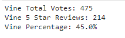
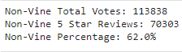

## Amazon Vine Analysis
## Overview of the analysis
This analysis focuses on publicly available reviews for Amazon products, and it utilizes Amazon Web Service's RDS and S3 to extract, transform, and load the data. The goal of the analysis is to distinguish reviews that were paid through Amazon's Vine service from those that were not, in order to determine if there is a bias in the reviews for the products. Specifically, the analysis looks at health and beauty products in the US region.

## Results
To determine if there is a bias in the reviews, the data is split into two dataframes: one for reviews that are part of the Vine service and one for reviews that are not. The tables are then used to determine the total number of reviews, the total number of five-star reviews, and the percentage of five-star reviews.

The results for reviews that are part of the Vine program are presented below:

The results for reviews that are not part of the Vine program are presented below:

## Summary
Based on the results, there appears to be a bias towards not giving five-star ratings for Vine reviews. An additional analysis can be conducted using the available data to further differentiate between Vine and non-Vine reviews that are verified purchases to see if they align more closely. This could potentially filter out reviews that are skewed one way or another.
